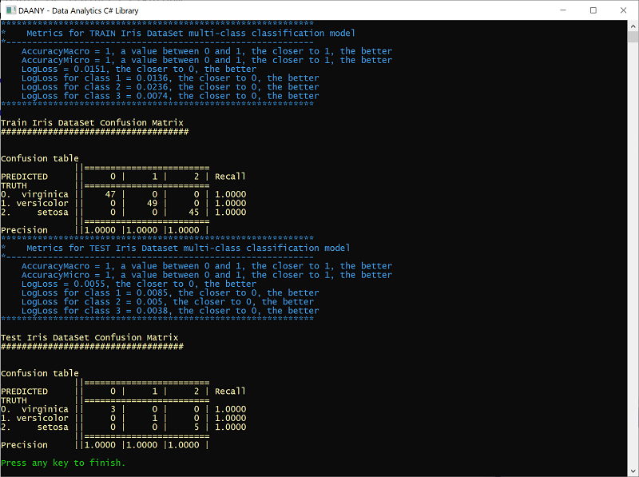

Daany - .NET **DA**ta **AN**al**Y**tics .NET library with the implementation of `DataFrame`, `Time series` decompositions and `Linear Algebra` `LAPACK` and `BLASS` routines.


[](https://www.nuget.org/packages/Daany.DataFrame/)

[](https://github.com/bhrnjica/daany/actions/workflows/CI_dotnet.yml)

[](https://github.com/bhrnjica/daany/actions/workflows/CI_dotnet_Linux.yml)

*[Daany Developer Guide](/docs/DevGuide/developer_guide.md)* - complete guide for developers.

# Software Requirements
The latest version of the library is built on `.NET 7` and above. 

In case you want to use it on `.NET Framework` and `Standard 2.0`, use older version below `v2.0`, or try to build the version from the source code. 

The main components with separate `NuGet` package of `Daany` library are:
- `Daany.DataFrame` - data frame implementation in pure C#.
- `Daany.DataFrame.Ext` - data frame extensions for additional implementation about plotting, data scaling and encoding and similar.
- `Daany.Stat` - time series decompositions e.g. SSA, STL, ....
- `Daany.LinA` - .NET wrapper of the  `Intel MKL` `LAPACK` and `BLASS` routines.

# Data Frame (`Daany.DataFrame`) and extensions (`Daany.DataFrame.Ext`)

`Daany.DataFrame` implementation follows the .NET coding paradigm rather than Pandas look and feel. The ``DataFrame`` implementation tries to fill the gap in ML.NET data preparation phase, and it can be easily passed to ML.NET pipeline. The `DataFrame` does not require any class type implementation prior to data loading and transformation.     

Once the `DataFrame` completes the data transformation, the extension methods provide the easy way to pass the data into `MLContex` object.

The following example shows `Daany.DataFrame` in action:

### Data Loading
We are going to use `iris data` file, which can be found on many places on the internet. The basic structure of the file is that it contains 5 tab separated columns: `sepal_length`,	`sepal_width`,	`petal_length`,	`petal_width`, and `species`.
The `Daany.DataFrame` class has predefined static methods to load data from `txt` or `csv` file. The following code loads the data and create `DataFrame` object:

```csharp
//read the iris data and create DataFrame object. 
var df = DataFrame.FromCsv(orgdataPath,sep:'\t');
```
Now that we have data frame, we can perform one of many supported data transformations. For this example we are going to create two new calculated columns:
```csharp
//calculate two new columns into dataset
df.AddCalculatedColumns(new string[] { "SepalArea", "PetalArea" }, 
        (r, i) =>
        {
            var aRow = new object[2];
            aRow[0]=Convert.ToSingle(r["sepal_width"]) * Convert.ToSingle(r["sepal_length"]);
            aRow[1] = Convert.ToSingle(r["petal_width"]) * Convert.ToSingle(r["petal_length"]);
            return aRow;
        });

```
Now the `df` object has two new columns:`SepalArea` and `PetalArea`. 

As the next step we are going to create a new `Data Frame` containing only three columns: `SepalArea`, `PetalArea` and `Species`:
```csharp
//create new data-frame by selecting only three columns
var derivedDF = df["SepalArea","PetalArea","species"];
```
For this purpose, we may use `Create` method by passing tuples of the old and new column name. In our case, we simply use indexer with column names to get a new `Data Frame`.

### Building a model by using ML.NET
We transformed the data and created final `data frame`, which will be passed to the ML.NET. Since the data is already in the memory, we should use `mlContext.Data.LoadFromEnumerable` ML.NET method. Here we need to provide the type for the loaded data. 

So let's create the `Iris` class with only three properties since we want to use only two columns as the `features` and one as the `label`. 
```csharp
class Iris
{
    public float PetalArea { get; set; }
    public float SepalArea { get; set; }
    public string Species { get; set; }
}
```
Once we have the class type implemented we can load the `data frame` into ML.NET:
```csharp
//Load Data Frame into Ml.NET data pipeline
IDataView dataView = mlContext.Data.LoadFromEnumerable<Iris>(derivedDF.GetEnumerator<Iris>((oRow) =>
 {
     //convert row object array into Iris row               
     var prRow = new Iris();
     prRow.SepalArea = Convert.ToSingle(oRow["SepalArea"]);
     prRow.PetalArea = Convert.ToSingle(oRow["PetalArea"]);
     prRow.Species = Convert.ToString(oRow["species"]);
     //
     return prRow;
 }));
```
The whole data has been loaded into the ML.NET pipeline, so we have to split the data into Train and Test set:
```csharp
//Split dataset in two parts: TrainingDataset (80%) and TestDataset (20%)
var trainTestData = mlContext.Data.TrainTestSplit(dataView, testFraction: 0.1);
var trainData = trainTestData.TrainSet;
var testData = trainTestData.TestSet;
```
Create the pipeline to prepare the train data for machine learning:
```csharp
//prepare data for ML
//one encoding output category column by defining KeyValues for each category
var dataPipeline = mlContext.Transforms.Conversion.MapValueToKey(
                            outputColumnName: "Label", 
                            inputColumnName: nameof(Iris.Species))
                
//define features columns
.Append(mlContext.Transforms.Concatenate("Features",nameof(Iris.SepalArea), nameof(Iris.PetalArea)));

```
Use data pipeline and `trainSet` to train and build the model. 
```csharp
//train and build the model

//create Trainer
var lightGbm = mlContext.MulticlassClassification.Trainers.LightGbm();

//train the ML model
var model = transformationPipeline.Append(lightGbm).Fit(preparedData);
```
### Model Evaluation
Once we have trained model, we can evaluate how it predicts the `Iris flower` from the  `testSet`:
```csharp
//evaluate test set
var testPrediction = model.Transform(testData);
var metricsTest = mlContext.MulticlassClassification.Evaluate(testPrediction);
ConsoleHelper.PrintMultiClassClassificationMetrics("TEST Iris Dataset", metricsTest);
ConsoleHelper.ConsoleWriteHeader("Test Iris DataSet Confusion Matrix ");
ConsoleHelper.ConsolePrintConfusionMatrix(metricsTest.ConfusionMatrix);
```
Once the program is run the output shows that we have 100% accurate prediction of Iris model using `testSet`:


# Daany Statistics (`Daany.Stat`)
Besides the `Daany.DataFrame` the library contains set of implementation with working on time series data. The following list contains some of them: 
- Conversion time series into `Daany.DataFrame` and `Series`
- Seasonal and Trend decomposition using Loess -`STL` time series decomposition,
- Singular Spectrum Analysis  `SSA` time series decomposition,
- Set of `Time Series` operations like moving average, etc....

### Singular Spectrum Analysis, SSA

With `SSA`, you can decompose the time series into any number of components (signals). The following code loads the famous `AirPassengers`time series data:

```csharp
var strPath = $"{root}/AirPassengers.csv";
var mlDF = DataFrame.FromCsv(strPath, sep: ',');
var ts = mlDF["#Passengers"].Select(f => Convert.ToDouble(f));//create time series from data frame
```
Now that we have `AirPasanger` time series object `ts`, we can create SSA object by passing the`ts` into it:
```csharp
//create Singular Spectrum Analysis object
var ssa = new SSA(ts);

//perform analysis
ssa.Fit(36);
```
So we created the `ssa` object by passing the number of components that we are going to create. Once the `ssa` object has been created we can call the ```Fit``` method to start with time series SSA analysis.

Once we have analyzed the time series, we can plot its components. The following plot shows the first 4 components:


The following plot shows how previous 4 components approximate the actual `AirPassengers` data:


At the end we can plot `ssa` predicted and actual values of the time series:


# Daany Linear Algebra (`Daany.LinA`)

The `Daany.LinA` provides the ability to use Intel MKL a native and super fast math library to perform linear algebra calculations. With the combination of the previous packages (`DataFrame` and `Daany.Stat`) you are able to transform and analyze very complex data, solve system of linear equations, find eigen values and vectors, use least square method etc. 

For more information how to use any of the implemented methods please see the *[Daany Developer Guide](/docs/DevGuide/developer_guide.md)*, test application implemented in the library  or you can use `unit test` methods which cover almost all implementation in the library. 
