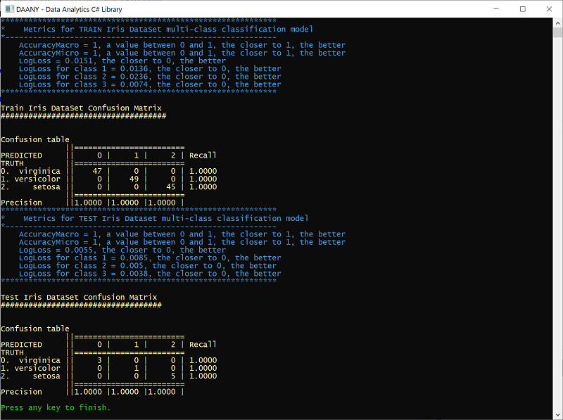
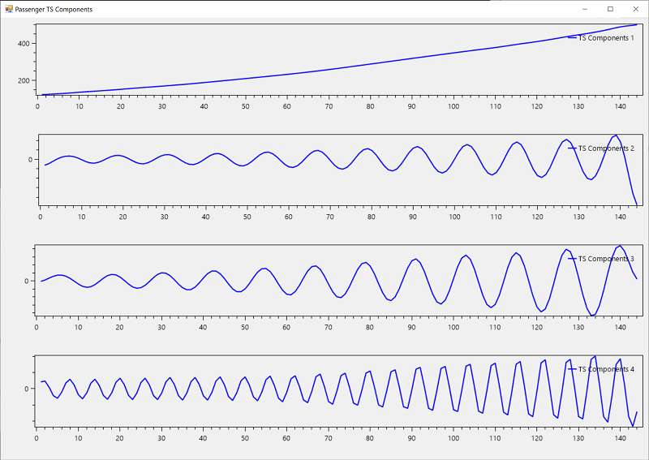
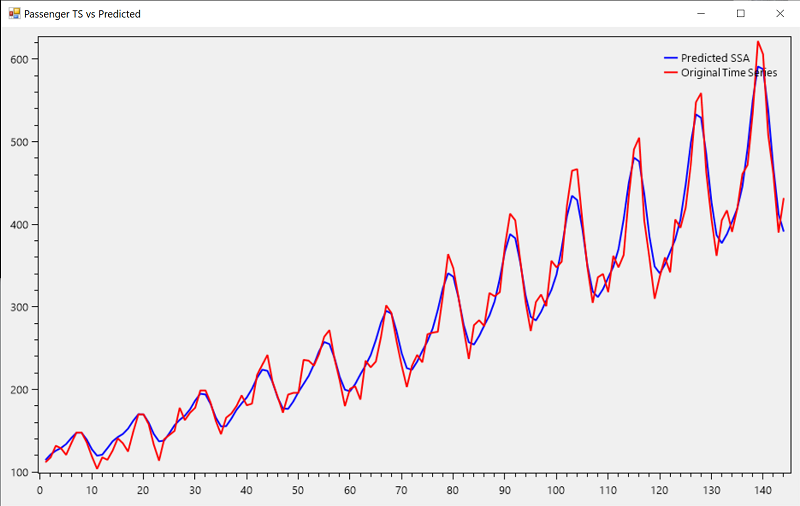
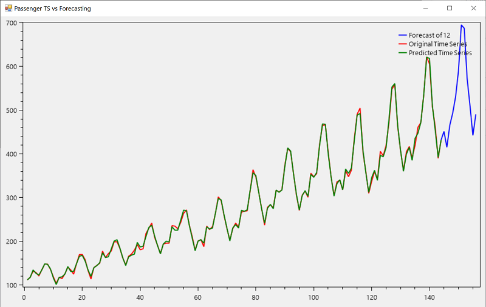

Daany - DAta ANalYtics C# library with the implementation of DataFrame, Time series decomposition and various statistical parameters.

# Data Frame

Daany ``DataFrame`` implementation follows the .NET coding paradigm rather than Pandas look and feel. The ``DataFrame`` implementation try to fill the gap in ML.NET data preparation phase, and it can be easely passed to ML.NET pipeline. The ``DataFrame`` does not require for any class type implementation prior to data loading and transformation.     

The ``DataFrame`` implementation contains basic capabilities like:

- [create a data frame from a list, a dictionary or from csv file](docs/01create_data_frame.md),
- [access data frame elements: row, column or cell through indexers](docs/02data_frame_indexers.md), 
- [persisting ``DataFrame`` into csv file](docs/03data_frame_save_csv.md),
- [filtering capabilities](test/df.test/df/08FilterTest.cs),
- [joining two or more data frames by common column](test/df.test/df/03JoinDataFramesTests.cs),
- [handling missing values](test/df.test/df/13MissingValuesTests.cs), 
- [grouping, aggregating data in the data frame](test/df.test/df/09GroupAndRoll.cs),
- [calculated columns](test/df.test/df/11CalculatedColumn.cs), [remove columns](test/df.test/df/03RemoveRowColTests.cs),
- apply an operation on a specific column/row in the data frame,
- ...

Once the ``DataFrame`` completes the data transformation, the extension method provides the easy way to pass the data into ```MLContex``` of the ML.NET Framework.
The following example shows Daany Data Frame in action:

### Data Loading
We are going to use iris data file, which can be found on many places on the internet. The basic structure of the file is that it contains 5 tab separated columns: ```sepal_length```,	```sepal_width```,	```petal_length```,	```petal_width```, and 	```species```.
The Daany DataFrame class has predefined static method to load data from txt or csv file. The following code loads the data and create DataFrame object:

```csharp
//read the iris data and create DataFrame object. 
var df = DataFrame.FromCsv(orgdataPath,sep:'\t');
```
Now that we have data frame we can perform one of many supported data transofrmations. For this example we are going to create two new columns into ```df```:
```csharp
//calculate two new columns into dataset
df.AddCalculatedColumns(new string[] { "SepalArea", "PetalArea" }, 
        (r, i) =>
        {
            var aRow = new object[2];
            aRow[0]=Convert.ToSingle(r["sepal_width"]) * Convert.ToSingle(r["sepal_length"]);
            aRow[1] = Convert.ToSingle(r["petal_width"]) * Convert.ToSingle(r["petal_length"]);
            return aRow;

        });

```
Now the ```df``` object has two new columns:```SepalArea``` and ```PetalArea```. 

Now we are going to create a new Data Frame containing only three columns: ```SepalArea```, ```PetalArea``` and ```Species```:
```csharp
//create new data-frame by selecting only three columns
var derivedDF = df["SepalArea","PetalArea","species"];
```
For this purpose, we use ```Create``` method by passing tuples of the old and new column name. In our case, we pass ```null``` for the new column name, which means keep old column name.

### Building model using ML.NET
Now we transformed the data and created final data frame, which will be passed to ML.NET. Since the data is already in the memory, we should use ```mlContext.Data.LoadFromEnumerable``` ML.NET method. Here we need to provide the type for the loaded data. 

So let's create the Iris class with only three properties since we want to use only two columns as the features and one as label. 
```csharp
class Iris
{
        public float PetalArea { get; set; }
        public float SepalArea { get; set; }
        public string Species { get; set; }
}
```
Now that we have class type implemented we can load the data frame into ML.NET:
```csharp
//Load Data Frame into Ml.NET data pipeline
IDataView dataView = mlContext.Data.LoadFromEnumerable<Iris>(derivedDF.GetEnumerator<Iris>((oRow) =>
 {
 //convert row object array into Iris row
                
 var prRow = new Iris();
 prRow.SepalArea = Convert.ToSingle(oRow["SepalArea"]);
 prRow.PetalArea = Convert.ToSingle(oRow["PetalArea"]);
 prRow.Species = Convert.ToString(oRow["species"]);
 //
 return prRow;
 }));
```
The whole data has been loaded into the ML.NET pipeline, so we have to split the data into Train and Test set:
```csharp
//Split dataset in two parts: TrainingDataset (80%) and TestDataset (20%)
var trainTestData = mlContext.Data.TrainTestSplit(dataView, testFraction: 0.1);
var trainData = trainTestData.TrainSet;
var testData = trainTestData.TestSet;
```
Create the pipeline to prepare the train data for machine learning:
```csharp
//prepare data for ML
//one encoding output category column by defining KeyValues for each category
var dataPipeline = mlContext.Transforms.Conversion.MapValueToKey(
                            outputColumnName: "Label", 
                            inputColumnName: nameof(Iris.Species))
                
//define features columns
.Append(mlContext.Transforms.Concatenate("Features",nameof(Iris.SepalArea), nameof(Iris.PetalArea)));

```
Use datapipeline and trainSet to train and build the model. 
```csharp
//train and build the model 
//create Trainer
var lightGbm = mlContext.MulticlassClassification.Trainers.LightGbm();

//train the ML model
var model = transformationPipeline.Append(lightGbm).Fit(preparedData);
```
### Model Evaluation
Once we have trained model, we can evaluate the model how it predicts the Iris flower from the test set:
```csharp
//evaluate test set
var testPrediction = model.Transform(testData);
var metricsTest = mlContext.MulticlassClassification.Evaluate(testPrediction);
ConsoleHelper.PrintMultiClassClassificationMetrics("TEST Iris Dataset", metricsTest);
ConsoleHelper.ConsoleWriteHeader("Test Iris DataSet Confusion Matrix ");
ConsoleHelper.ConsolePrintConfusionMatrix(metricsTest.ConfusionMatrix);
```
Once the program is run, the output shows that we have 100% accurate Iris model:


# Daany Statistics
Besides the DataFrame Daany library contains set of implementation with working on time series data:
- Conversion time series into ```Daany.DataFrame```
- STL time series decomposition,
- Singular Spectrum Analysis decomposition,
- Set of Time Series operations like moving average, etc....

### Singular Spectrum Analysis, SSA

With SSA, you can decompose the time series into any number of components (signals). The following code loads the famous time series data:

```csharp
var strPath = $"{root}/AirPassengers.csv";
var mlDF = DataFrame.FromCsv(strPath, sep: ",");
var ts = mlDF["#Passengers"].Select(f => Convert.ToDouble(f));//create time series
```
Now that we have AirPasanger time series, we can create SSA object by passing the time series into it:
```csharp
//create Singular Spectrum Analysis object
var ssa = new SSA(ts);
//perform analysis
ssa.Fit(36);
```
So we created the ssa object by passing the number of components that we are going to create. Once the ssa object has been created we can call the ```Fit``` method to start with time series ssa analysis.

Once we have analyzed the time series, we can plot its components. The following plot shows the first 4 components:



The following plot shows how previous 4 components, aproximate the actual AirPassengers data:




At the end we can plot ssa predicted and actual values of the time series:



