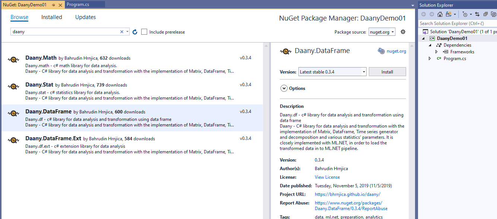
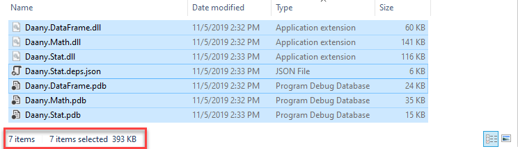
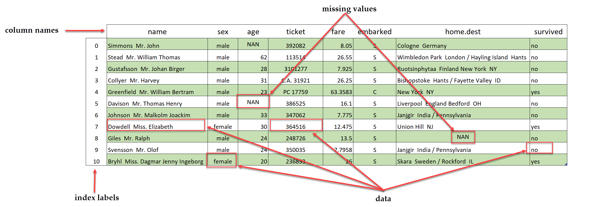
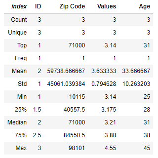
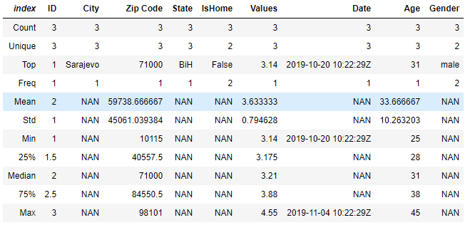
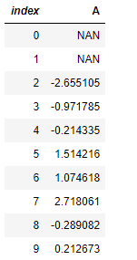
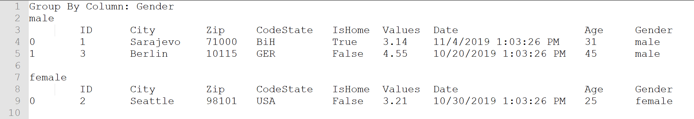
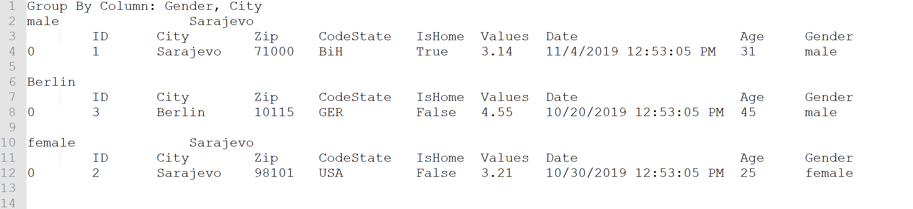
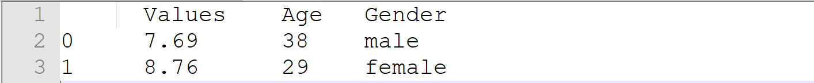
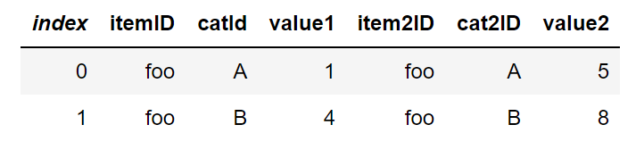

```Daany``` – .NET DAta ANalYtics library 
====================================


Introduction
=======================

```Daany``` is .NET data analytics library written in C# and it supposed to be a tool
for data preparation, feature engineering and other kinds of data
transformations prior to creating ml-ready data set. It is .NET Core based
library with ability to run on Windows Linux based distribution and Mac. It is
based on .NET Standard 2.0.

Besides data analysis, the library implements a set of statistics or data
science features e.g. time series decompositions, optimization performance
parameters and similar. 

Currently ```Daany``` project consists of four main
components:

-   ```Daany.DataFrame```,
-   ```Daany.Stats```,
-   ```Daany.Math``` and
-   ```Daany.DataFrame.Ext```

The main ```Daany``` component is ```Daany.DataFrame``` - a data frame implementation for
data analysis. It is much like ```Pandas``` but the component is not going to follow
pandas implementation. It is suitable for doing data exploration and preparation
with ```C# Jupyter Notebook```. In order to create or load data into data frame it
doesn’t require any predefined class type. In order to defined relevant value type of each column all data are parsed internally during data frame creation. The ```Daany.DataFrame``` implements set of powerful features for data manipulation, handling missing values, calculated columns, merging two or more data frame into one, and similar. It is handy for extracting its rows or columns as series of elements and put into the chart to visualizing the data.

```Daany.Stat``` is a collection of statistics features e.g. time series
decompositions, optimization, performance parameters and similar.

```Daany.Math``` is a component within data frame with implementation of od matrix and related
linear algebra capabilities. It also contains some implementation of other great open source projects. The component is not going to be separate NuGet package.

```Daany.DataFrame.Ext``` contains extensions for ```Daany.DataFrame``` component, but they are related to other projects mostly to ML.NET. The ```Daany.DataFrame```  should not be dependent on ```ML.NET```  and other libraries. So, any future data frame feature which depends on something other than ```Daany.Math```, should be placed in ```Daany.Ext```.

The project is developed as a need to have a set of data transformation features
in one library while I am working with machine learning. So, I thought it might
help to others. Currently, the library has pretty much data transformation
features and might be your number one data analytics library on .NET
platform. Collaboration to the project is also welcome.

How to start with Daany
=======================

```Daany``` is 100% .NET Core component and can be run on any platform .NET Core supports, from the Windows x86/x64 to Mac or Linux based OS. It can be used by Visual Studio or Visual Studio Code. It consisted of 4 NuGet packages, so
the easiest way to start with it is to install the packages in your .NET
application. Within Visual Studio create or open your .NET application and open
NuGet packages window. Type ```Daany``` in the browse edit box and hit enter. You can
find four packages starting with Daany. You have few options to install the
packages.

1.  Install ```Daany.DataFrame```  – only. *Use this option if you want only data
    analysis by using DataFrame. Once you click Install button, Daany.DataFrame
    and Daany.Math will be installed into your project app.*

2.  Install ```Daany.Stat``` package. This package already contains ```DataFrame```, as well as time series decomposition and related statistics features.



Once you install the packages, you can start developing your app using Daany
packages.

Using ```Daany``` as assembly reference
===========================================

Since ```Daany``` has no dependency to other libraries you can copy three dlls and add them as reference to your project.



In order to do so clone the project from [http://github.com/bhrnjica/daany](http://github.com/bhrnjica/daany),build it and copy ```Daany.DataFrame.dll```, ```Daany.Math.dll``` and ```Daany.Stat.dll``` to your project as assembly references. Whole project is just 270 KB.


Namespaces in Daany
================================================

```Daany``` project contains several namespaces for separating different
implementation. The following list contains relevant namespaces:

-   ```using Daany``` – data frame and related code implementation,
-   ```using Daany.Ext``` – data frame extensions, used with dependency on third party
    library,
-   ```using Daany.MathStuff``` – math related stuff implemented in Daany,
-   ```using Daany.Optimizers``` – set of optimizers like SGD,
-   ```using Daany.Stat``` – set of statistics implementations in the project.

Working with ```Daany.DataFrame```
============================

The main part of ```Daany``` project is ```Daany.DataFrame``` -  an c\# implementation of data frame. A data frame is software component used for handling tabular data, especially for data preparation, feature engineering and analysis during development of machine learning models. The concept of ```Daany.DataFrame``` implementation is based on simplicity and .NET coding standard. It represents tabular data consisting of columns and rows. Each column has name and type and each row has its index and label.
Usually, rows indicate a zero axis, while columns indicate axis one.

The following image shows a DataFrame structure



The basic components of the DataFrame are:

-   ```header``` - list of column names,
-   ```index```  – list of object representing each row,
-   ```data``` – list of values in the DataFrame,
-   ```missing value``` – data with no values in data frame.

The image above shows the data frame components visually, and how they are
positioned in the data frame.

How to create ```Daany.DataFrame```  .NET object
-----------------------------------------

In order to create a DataFrame there are several options:

-   from a list of values, by specifying column names and row count
-   from a dictionary, letting keys be column names and values be column values,
-   from text-based file, where each line represents row values,
-   as a return object for almost any data frame operations.

## Create ```DataFrame``` from a list of data.

```Daany.DataFrame```  can be created by passing 1d list of data and column header. The following code shows such action.

```csharp
//define a list of data
var lst = new List<object>() { 1, "Sarajevo", 77000, "BiH", true, 3.14,DateTime.Now.AddDays(-20),
2, "Seattle", 98101, "USA", false, 3.21, DateTime.Now.AddDays(-10),
3, "Berlin", 10115, "GER", false, 4.55, DateTime.Now.AddDays(-5),
};

//define column header for the DataFrame
var columns = new List<string>() { "ID", "City", "Zip Code", "IsHome",
"Values", "Date" };

//create data frame with 3 rows and 7 columns
var df = new DataFrame(lst, columns);
//check the size of the data frame
Assert.Equal(3, df.RowCount());
Assert.Equal(7, df.ColCount());
```

## Create ```DataFrame``` from dictionary

Similarly ```Daany.DataFrame```  can be created by passing dictionary collection. The following code shows how to create DataFrame from the dictionary:

```csharp
//define a dictionary of data
var dict = new Dictionary<string, List<object>>
{

    { "ID",new List<object>() { 1,2,3} },
    { "City",new List<object>() { "Sarajevo", "Seattle", "Berlin" } },
    { "Zip Code",new List<object>() { 71000,98101,10115 } },
    { "State",new List<object>() {"BiH","USA","GER" } },
    { "IsHome",new List<object>() { true, false, false} },
    { "Values",new List<object>() { 3.14, 3.21, 4.55 } },
    { "Date",new List<object>() { DateTime.Now.AddDays(-20) ,
    DateTime.Now.AddDays(-10) , DateTime.Now.AddDays(-5) } },

};

//create data frame with 3 rows and 7 columns
var df = new DataFrame(dict);
//check the size of the data frame
Assert.Equal(3, df.RowCount());
Assert.Equal(7, df.ColCount());
```


## Create ```DataFrame``` by loading data from a file

By using static method ```DataFrame.FromCsv``` a user can create data frame object
from the ``csv`` file. Otherwise, data frame can be persisted on disk by calling
static method ```DataFrame.ToCsv```. 
The following code shows how to use static methods ```ToCsv``` and ```FromCsv``` to show persisting and loading data to data frame:

```csharp
string filename = "df_file.txt";
//define a dictionary of data
var dict = new Dictionary<string, List<object>>
{
    { "ID",new List<object>() { 1,2,3} },
    { "City",new List<object>() { "Sarajevo", "Seattle", "Berlin" } },
    { "Zip Code",new List<object>() { 71000,98101,10115 } },
    { "State",new List<object>() {"BiH","USA","GER" } },
    { "IsHome",new List<object>() { true, false, false} },
    { "Values",new List<object>() { 3.14, 3.21, 4.55 } },
    { "Date",new List<object>() { DateTime.Now.AddDays(-20) , DateTime.Now.AddDays(-10) , DateTime.Now.AddDays(-5) } },

};

//create data frame with 3 rows and 7 columns
var df = new DataFrame(dict);

//first Save data frame on disk and load it
DataFrame.ToCsv(filename, df);

//create data frame with 3 rows and 7 columns
var dfFromFile = DataFrame.FromCsv(filename, sep:',');

//check the size of the data frame
Assert.Equal(3, dfFromFile.RowCount());
Assert.Equal(new string[] { "ID", "City", "Zip Code", "State", "IsHome", "Values", "Date" }, dfFromFile.Columns);
Assert.Equal(7, dfFromFile.ColCount());
```
First, we created data frame from the dictionary collection. Then we store data frame to file. After successfully saving, we load the same data frame from the csv file. The end of the code snippet, put asserts in order to prove everything is correctly implemented.

In case the performance is important, you should pass column types to `FromCSV` method in order to achieve up to 50% of loading time. 
For example the following code loads the data from the file, by passing predefined column types:
```csharp
//defined types of the column 
var colTypes1 = new ColType[] { ColType.I32, ColType.IN, ColType.I32, ColType.STR, ColType.I2, ColType.F32, ColType.DT };
//create data frame with 3 rows and 7 columns
var dfFromFile = DataFrame.FromCsv(filename, sep: ',', colTypes: colTypes1);
```   

## Other ways to create a ```DataFrame```

Besides above, the data frame can be created on other ways:

- Create data frame from existing one - This method can be used in order to create
new data frame with different numbers of columns. For example, the new data frame
can be created from existing one by specifying specific columns:

````csharp
//now create a new data frame with only three columns
var newDf = df["City", "Zip Code", "State"];
//check the size of the data frame
Assert.Equal(3, df.RowCount());
Assert.Equal(3, newDf.ColCount());
````

- Data frame can be created using ```Create``` method and passing tuples of
existing and new column name. For example:

```csharp
//create data frame with 3 rows and 7 columns
var df = DataFrame.FromCsv(\$"{rootfolder}/simple_data_frame.txt", sep: ',',
names: null, dformat: "MM/dd/yyyy");

//now create a new data frame with three columns which can be renamed during creation
var newDf = df.Create(("City","Place"), ("Zip Code", null), ("State",
"Country"));

//check the size of the data frame
Assert.Equal(3, newDf.RowCount());
Assert.Equal(new string[] { "Place", "Zip Code", "Country" }, newDf.Columns);
Assert.Equal(3, newDf.ColCount());
```

In case you want to remain the same column name, pass ```null``` as second tuple
item, or write the same name.

- It is handy to create an empty data frame with specific column header. To do so
use similar code like following:

```csharp
var cols = new string[] { "Place", "Country", "Zip Code", "Values" };

//create empty data frame with 4 columns
var df = DataFrame.CreateEmpty(cols);

//check the size of the data frame
Assert.Equal(0, df.RowCount());
Assert.Equal(new string[] { "Place", "Country", "Zip Code", "Values" },
df.Columns);
Assert.Equal(4, df.ColCount());
```

- Data frame is created almost in any performed operation like sorting, filtering,
grouping, aggregation and similar.

Enumeration of  ```DataFrame```
--------------------------

Enumeration of data frame means iterating it row by row.
```Daany.DataFrame```  provides three ways for the enumeration:

-   **Strongly typed enumeration** – it means that you have to provide a Class type
    during enumeration, as well as mapping logic for conversion data frame row into
    the class object. This is done by providing callback mapping method.

-   **Enumeration by dictionary** – it means that each data frame row is returned as
    dictionary, where keys are column names and values are row array.

-   **Enumeration by list** – it means the each data frame row is returned as list
    of data.

### Strongly typed enumeration

This enumeration is suitable when data frame need to be converted into list of
custom types. Also, in order to convert ```Daany.DataFram``` into ```ML.NET```  ```IDataView``` you have to use typed enumeration. The following code shows how data set as previously loaded into ```Daany.DataFrame```  is converted into ```ML.NET``` ```IDataView```.

Assume we defined ```Person``` class as follow:

```csharp
class Person
{
    public int ID { get; set; }
    public string City { get; set; }
    public int Zip { get; set; }
    public string State { get; set; }
    public bool IsHome { get; set; }
    public float Values { get; set; }
    public DateTime Date { get; set; }
}
```

Previously we created ```Daany.DataFrame```  from the file containing lists of Persons. Conversion from ```Daany.DataFrame``` to list of ```Persons``` the following code should be implemented:

```csharp
//create data frame with 3 rows and 7 columns
var df = DataFrame.FromCsv($"{rootfolder}/simple_data_frame.txt");

//convert data frame into strongly typed list
List<Person> list = df.GetEnumerator<Person>((oRow) =>
{
    //convert row object array into Iris row

    var prRow = new Person();
    prRow.ID = Convert.ToInt32(oRow["ID"]);
    prRow.City = Convert.ToString(oRow["City"]);
    prRow.Zip = Convert.ToInt32(oRow["Zip Code"]);
    prRow.State = Convert.ToString(oRow["State"]);
    prRow.IsHome = Convert.ToBoolean(oRow["IsHome"]);
    prRow.Values = Convert.ToSingle(oRow["Values"]);
    prRow.Date = Convert.ToDateTime(oRow["Date"]);
    //
    return prRow;
}).ToList();

//check some data from the second row
Assert.Equal("Seattle", list[1].City);
Assert.Equal("USA", list[1].State);
Assert.Equal(3.21f, list[1].Values);
```
As can be seen, ```GetEnumerator``` takes one argument `oRow` which is dictionary of the
data frame row. The `oRow` is passed into delegate where conversion is performed.

### Enumeration by dictionary

In order to enumerate data frame by dictionary call ```GetEnumerator``` method, without providing custom type. The following code uses previously loaded data frame and perform `Linq` operators against it.

```csharp
//create data frame with 3 rows and 7 columns
var df = DataFrame.FromCsv($"{rootfolder}/simple_data_frame.txt");

//get second data frame row
//row2 is a dictionary with column names as keys
var row2 = df.GetEnumerator().Skip(1).First();

//check some data from the second row
Assert.Equal("Seattle", row2["City"]);
Assert.Equal("USA", row2["State"]);
Assert.Equal(3.21f, row2["Values"]);
```

### Enumeration by list

Data frame can be enumerated by returning the row as a list. This
method can be use when the performance is important, otherwise use previous method. The
following code shows how to use enumeration by list.

```csharp
//create data frame with 3 rows and 7 columns
var df = DataFrame.FromCsv($"{rootfolder}/simple_data_frame.txt");

//get second data frame row
//row2 is a dictionary with column names as keys
var row2 = df.GetRowEnumerator().FirstOrDefault();

//check some data from the second row
Assert.Equal("Sarajevo", row2[1]);
Assert.Equal("BiH", row2[3]);
Assert.Equal(3.14f, row2[5]);
```


Selecting data in ```Daany``` data frame
==================================

Accessing data in data frame can be achieved in many ways. Also different kind of data can be selected from the data frame. You can select a data as a single values, or list of data from a single row, list of column values or data frame as subset of the existing one. Let's see how can the column be selected from the data frame. 

## Column selection

This code sample select two columns separately from data frame, and convert them
into array and list.

```csharp
//create data frame with 3 rows and 7 columns
var df = DataFrame.FromCsv($"{rootfolder}/simple_data_frame.txt");

//select one column from the data frame
var cities = df["City"].ToArray();
var zipCodes = df["Zip Code"].ToList();

//check for values
Assert.Equal(3, cities.Length);
Assert.Equal("Sarajevo", cities[0]);
Assert.Equal("Seattle", cities[1]);
Assert.Equal("Berlin", cities[2]);

//check for values
Assert.Equal(3, zipCodes.Count);
Assert.Equal(71000, zipCodes[0]);
Assert.Equal(98101, zipCodes[1]);
Assert.Equal(10115, zipCodes[2]);
```

## Two or more columns selection

Selecting more than one column at once returns data frame. The following code
creates new data frame from selected columns:

```csharp
//create data frame with 3 rows and 7 columns
var df = DataFrame.FromCsv($"{rootfolder}/simple_data_frame.txt");

//select one column from the data frame
var citiesDf = df["City", "Zip Code"];

//check for values
Assert.Equal(3, citiesDf.RowCount());
Assert.Equal(2, citiesDf.ColCount());
```

## Row selection
Selecting data by rows returns whole row from the data frame. The following code
returns third rows from the existing data frame.

```csharp
//select third row from data frame
//3, "Berlin", 10115, "GER", false, 4.55, DateTime.Now.AddDays(-5)
var row = df[2].ToArray();

//check for values
Assert.Equal(7, row.Length);
Assert.Equal(2, row[0]);
Assert.Equal("Berlin", row[1]);
```

## Data selection

Selecting data is achieved by using zero-based position of row and column or by column name and rows position. The following code select ```City``` from the third row:

```csharp
//create data frame with 3 rows and 7 columns
var df = DataFrame.FromCsv($"{rootfolder}/simple_data_frame.txt");

//select city from the third row
var city = df[2,1];
var city1 = df["City", 2];

//check for values
Assert.Equal(city,city1);
Assert.Equal("Berlin", city1);
```


Operations in `Daany.DataFrame`
=============================================

```Daany.DataFrame```  supports the following operations:

-   Add/Insert Column,
-   AddRows,
-   AddCalculatedColumns,
-   Aggregate,
-   Describe,
-   Drop, DropNA and FillNA,
-   Filter and RemoveRows,
-   SortBy and SortByDescending,
-   GroupBy and Rolling
-   Merge and Join two data frames
-   Select.

In the next section eery feature is going to be presented.


Add/Insert new columns into data frame
--------------------------

Adding one or more new columns into data frame can be achieve by calling
```AddColumns``` data frame method. The following code add two new columns `Age` and
`Gender` to existing data frame:

```csharp
//create data frame with 3 rows and 7 columns
var df = DataFrame.FromCsv($"{rootfolder}/simple_data_frame.txt");

//add Age column
var newCols = new Dictionary<string, List<object>>()
    {
        { "Age", new List<object>() { 31, 25, 45 } },
        { "Gender", new List<object>() { "male", "female", "male" } } 
    };

//add column
var newDf = df.AddColumns(newCols);

//check for values
Assert.Equal(9, newDf.ColCount());
Assert.Equal(25, newDf["Age", 1]);
Assert.Equal("female", newDf["Gender", 1]);
```
Similarly, column can be inserted at any column list position. In case the above column should be inserted somewhere in column header, `InsertColumn` should be called:

```csharp
//inser column at third position
var newDf= df.InsertColumn("Age", newCol, 2 );
```


Add new rows into data frame
------------------------------------

In order to add one or more rows into existing data frame the `AddRow` or `AddRows`
should be called respectively. The following code shows adding one row into
existing data frame:

```csharp
//create data frame with 3 rows and 7 columns
var df = DataFrame.FromCsv($"{rootfolder}/simple_data_frame.txt");

//new row
var newRow = new List<object>() { 4, "London", 11000, "GB", false, 5.55,
DateTime.Now.AddDays(-5) };

//add column
df.AddRow(newRow);
//check for values
Assert.Equal(7, df.ColCount());
Assert.Equal(4, df.RowCount());
Assert.Equal("GB", df["State", 3]);
Assert.Equal(5.55, df["Values", 3]);
```

In case more than one rows should be added into data frame we can used `AddRows`
method by passing DataFrame object containing new rows. The data frame object must have the same number of columns as existing. More than one row can be added by calling `AddRow` from the loop.

Add calculated column
---------------------

Adding calculated column into data frame is often task. We use this feature when performing features engineering or feature selection during data preparation. In order to add new column into data frame which is based on the calculation on each rows in the data frame use `AddCalculatedColumn` method. The method has two variants with current row as dictionary or as list collection. Both methods are very similar, so we are going to show the example by using the first variant. The
following code shows adding calculated column into existing data frame:

```csharp
var dict = new Dictionary<string, List<object>>
    {
        { "col1",new List<object>() { 1,13,25,37,49} },
        { "col2",new List<object>() { 2,14,26,38,50} },
        { "col3",new List<object>() { 3,15,27,39,51} },
        { "col4",new List<object>() { 4,16,28,40,52} },
        { "col5",new List<object>() { 5,17,29,41,53} },
        { "col6",new List<object>() { 6,18,30,42,54} },
        { "col7",new List<object>() { 7,19,31,43,55} },
        { "col8",new List<object>() { 8,20,32,44,56} },
        { "col9",new List<object>() { 9,21,33,45,57} },
        { "col10",new List<object>(){ 10,22,34,46,58} },
    };

//
var df = new DataFrame(dict);
var sCols = new string[] { "col11", "col12" };
var df01 = df.AddCalculatedColumns(sCols, (row, i) => calculate(row, i));

//column test
var c1 = new int[] { 11, 23, 35, 47, 59};
var c2 = new int[] { 12, 24, 36, 48, 60};

for (int i = 0; i < df.Values.Count; i++)
    Assert.Equal(i+1, df.Values[i]);

//local function declaration
object[] calculate(IDictionary<string, object> row, int i)
    {
        return new object[2] { i * (row.Count() +2) + row.Count() + 1,
        i * (row.Count()+ 2) + row.Count() +2};
    }
```
As can be seen two new columns have been added by the calculations made by the current
row.

Aggregation in data frame
-------------------------

Aggregation process include performing arithmetic operation on data frame. The result of
the aggregation is new list of values or new data frame containing the result of
aggregation operations. The following code shows Aggregation method in action:

```csharp
var date = DateTime.Now.AddDays(-5);
//define a dictionary of data
var dict = new Dictionary<string, List<object>>
{
    { "ID",new List<object>() { 1,2,3} },
    { "City",new List<object>() { "Sarajevo", "Seattle", "Berlin" } },
    { "Zip Code",new List<object>() { 71000,98101,10115 } },
    { "State",new List<object>() {"BiH","USA","GER" } },
    { "IsHome",new List<object>() { true, false, false} },
    { "Values",new List<object>() { 3.14, 3.21, 4.55 } },
    { "Date",new List<object>() { DateTime.Now.AddDays(-20) ,
    DateTime.Now.AddDays(-10) , date } },
    { "Age", new List<object>() { 31, 25, 45 } },
    { "Gender", new List<object>() { "male", "female", "male" } }
};

//create df
var df = new DataFrame(dict);

//define aggregation
var agg = new Dictionary<string, Aggregation>() 
        { 
            {"ID",Aggregation.Count},
            {"City",Aggregation.Top},
            {"Date", Aggregation.Max},
            {"Values",Aggregation.Avg },
        };

var row = df.Aggragate(agg);
var val = new List<object>() { 3, "Sarajevo", 3.6333333333333329, date };

Assert.Equal(val, row);
```

As can be seen from the code above. The aggregation process included performing
different operation on four columns ({`"ID"`,`"City"`,`"Date"`,`"Values"`). In case
default argument `allColumns:true` then all columns from data frame will be shown
in the aggregate result.

In case more than one aggregate operation should be applied to single column, then the second aggregate method will be used. 
```csharp
var date = DateTime.Now.AddDays(-5);
//define a dictionary of data
var dict = new Dictionary<string, List<object>>
{
    { "ID",new List<object>() { 1,2,3} },
    { "City",new List<object>() { "Sarajevo", "Seattle", "Berlin" } },
    { "Zip Code",new List<object>() { 71000,98101,10115 } },
    { "State",new List<object>() {"BiH","USA","GER" } },
    { "IsHome",new List<object>() { true, false, false} },
    { "Values",new List<object>() { 3.14, 3.21, 4.55 } },
    { "Date",new List<object>() { DateTime.Now.AddDays(-20) , DateTime.Now.AddDays(-10) , date } },
    { "Age", new List<object>() { 31, 25, 45 } },
    { "Gender", new List<object>() { "male", "female", "male" } }
};

//create df
var df = new DataFrame(dict);

//define aggregation
var agg = new Dictionary<string, Aggregation[]>() { {"ID",new Aggregation[]{Aggregation.Count,Aggregation.Sum }},
                                                    {"City",new Aggregation[]{Aggregation.Top,Aggregation.Frequency }},
                                                    {"Date", new Aggregation[]{Aggregation.Max }},
                                                    {"Values",new Aggregation[]{Aggregation.Avg } },
                                                };
var newDf = df.Aggragate(agg);
var val = new List<object>() { 3, null, null, null, 6, null, null, null, null, "Sarajevo", null, null, 
    null, 1, null, null, null, null, 3.633333, null, null, null, null, date};

//
Assert.Equal(new string[] {"Count", "Sum", "Top", "Freq", "Mean", "Max" }, newDf.Index);
for (int i = 0; i < newDf.Values.Count; i++)
    Assert.Equal(val[i], newDf.Values[i]);
```

Describe data frame
------------------------------------
Describe data frame method prints out the based descriptive statistics for specified columns in the data frame. The following code shows usage of `Describe` method.
```csharp
var date = DateTime.Now.AddDays(-5);
//define a dictionary of data
var dict = new Dictionary<string, List<object>>
{
    { "ID",new List<object>() { 1,2,3} },
    { "City",new List<object>() { "Sarajevo", "Seattle", "Berlin" } },
    { "Zip Code",new List<object>() { 71000,98101,10115 } },
    { "State",new List<object>() {"BiH","USA","GER" } },
    { "IsHome",new List<object>() { true, false, false} },
    { "Values",new List<object>() { 3.14, 3.21, 4.55 } },
    { "Date",new List<object>() { DateTime.Now.AddDays(-20) , DateTime.Now.AddDays(-10) , date } },
    { "Age", new List<object>() { 31, 25, 45 } },
    { "Gender", new List<object>() { "male", "female", "male" } }
};

//create df
var df = new DataFrame(dict);
df.Describe()
```
The following image shows the output of the `Describe` method.




In case all columns should be presented the `Describe` method should be called with `df.Describe(numericOnly:false)`and the output should looks like:




Drop columns and missing value handling
-------------------------------------

We can drop or remove column from the data frame based on different criterion.
For example the following code will remove columns `ID`, `Date`, `Age`, `Gender`
from the existing data frame:

```csharp
var date1 = DateTime.Now.AddDays(-20);
var date2 = DateTime.Now.AddDays(-10);
var date3 = DateTime.Now.AddDays(-5);

//define a dictionary of data
var dict = new Dictionary<string, List<object>>
{
    { "ID",new List<object>() { 1,2,3} },
    { "City",new List<object>() { "Sarajevo", "Seattle", "Berlin" } },
    { "Zip Code",new List<object>() { 71000,98101,10115 } },
    { "State",new List<object>() {"BiH","USA","GER" } },
    { "IsHome",new List<object>() { true, false, false} },
    { "Values",new List<object>() { 3.14, 3.21, 4.55 } },
    { "Date",new List<object>() { date1 , date2 , date3 } },
    { "Age", new List<object>() { 31, 25, 45 } },
    { "Gender", new List<object>() { "male", "female", "male" } }
};

//create df
var df = new DataFrame(dict);
var df2 = df.Drop("ID", "Date", "Age", "Gender");
var lst = new List<object>() {"Sarajevo", 71000, "BiH", true, 3.14,"Seattle",
98101, "USA", false, 3.21, "Berlin",10115, "GER", false, 4.55 };

//
Assert.Equal(new string[] { "City", "Zip Code", "State", "IsHome", "Values" },
df2.Columns);
Assert.Equal(lst, df2.Values);
```

Drop row can be performed in case we want to remove missing values. The
following code show dropping rows containing missing values:

```csharp
var date = DateTime.Now.AddDays(-20);
//define a dictionary of data
var dict = new Dictionary<string, List<object>>
{
    { "ID",new List<object>() { 1,2,3} },
    { "City",new List<object>() { "Sarajevo", "Seattle", DataFrame.NAN } },
    { "Zip Code",new List<object>() { 71000,98101,10115 } },
    { "State",new List<object>() {"BiH","USA","GER" } },
    { "IsHome",new List<object>() { true, false, false} },
    { "Values",new List<object>() { 3.14, 3.21, 4.55 } },
    { "Date",new List<object>() { date , DateTime.Now.AddDays(-10) , date } },
    { "Age", new List<object>() { 31, 25, 45 } },
    { "Gender", new List<object>() { "male", DataFrame.NAN, "male" } }
};

//create df
var df = new DataFrame(dict);
//drop rows with missing values
var newDf = df.DropNA();
//check for values
Assert.Equal(9, newDf.ColCount());
Assert.Equal(1, newDf.RowCount());
Assert.Equal(new object[] {1, "Sarajevo", 71000, "BiH", true, 3.14,date, 31,
"male" }, newDf[0]);
```
Replacing missing values with specified value can be achieve by using `FillNA`
method. The following code replaces the missing values with `replValue`:

```csharp
var date = DateTime.Now.AddDays(-20);
//define a dictionary of data
var dict = new Dictionary<string, List<object>>
{
    { "ID",new List<object>() { 1,2,3} },
    { "City",new List<object>() { "Sarajevo", "Seattle", DataFrame.NAN } },
    { "Zip Code",new List<object>() { 71000,98101,10115 } },
    { "State",new List<object>() {"BiH","USA","GER" } },
    { "IsHome",new List<object>() { true, false, false} },
    { "Values",new List<object>() { 3.14, 3.21, 4.55 } },
    { "Date",new List<object>() { date , DateTime.Now.AddDays(-10) , date } },
    { "Age", new List<object>() { 31, 25, 45 } },
    { "Gender", new List<object>() { "male", "female", "male" } }
};

//create df
var df = new DataFrame(dict);

//drop rows with missing values
string replValue = "Berlin";
df.FillNA(replValue);

//check for values
Assert.Equal(9, df.ColCount());
Assert.Equal(3, df.RowCount());
Assert.Equal(new object[] { 3, "Berlin", 10115, "GER", false, 4.55, date, 45,
"male" }, df[2]);
```


Filter and Conditional Remove
----------------------------------------------------
Filter operation returns data frame with specific filter condition. Also, RemoveRows acts very similarly by using delegate implementation. The following code shows filter data frame between dates:

```csharp
var date1 = DateTime.Now.AddDays(-20);
var date2 = DateTime.Now.AddDays(-10);
var date3 = DateTime.Now.AddDays(-5);
//define a dictionary of data
var dict = new Dictionary<string, List<object>>
{
    { "ID",new List<object>() { 1,2,3} },
    { "City",new List<object>() { "Sarajevo", "Seattle", "Berlin" } },
    { "Zip Code",new List<object>() { 71000,98101,10115 } },
    { "State",new List<object>() {"BiH","USA","GER" } },
    { "IsHome",new List<object>() { true, false, false} },
    { "Values",new List<object>() { 3.14, 3.21, 4.55 } },
    { "Date",new List<object>() { date3 , date2 , date1 } },
    { "Age", new List<object>() { 31, 25, 45 } },
    { "Gender", new List<object>() { "male", "female", "male" } }
};

//create df
var df = new DataFrame(dict);

//filter data frame between dates
var opers = new FilterOperator[2] { FilterOperator.Greather, FilterOperator.Less };
var cols = new string[] { "Date", "Date" };
var values = (new DateTime[] { DateTime.Now.AddDays(-7), DateTime.Now.AddDays(-3) }).Select(x => (object)x).ToArray();
//filter
var filteredDF = df.Filter(cols, values, opers);
//
Assert.Equal(1, filteredDF.RowCount());
Assert.Equal(new List<object>() { 1, "Sarajevo", 71000, "BiH", true, 3.14, date3, 31, "male" }, filteredDF[0]);

```
The following code shows how to remove rows containing `Miami` as column value.

```csharp
var date = DateTime.Now.AddDays(-20);
//define a dictionary of data
var dict = new Dictionary<string, List<object>>
{
    { "ID",new List<object>() { 1,2,3} },
    { "City",new List<object>() { "Sarajevo", "Seattle", DataFrame.NAN } },
    { "Zip Code",new List<object>() { 71000,98101,10115 } },
    { "State",new List<object>() {"BiH","USA","GER" } },
    { "IsHome",new List<object>() { true, false, false} },
    { "Values",new List<object>() { 3.14, 3.21, 4.55 } },
    { "Date",new List<object>() { date , DateTime.Now.AddDays(-10) , date } },
    { "Age", new List<object>() { 31, 25, 45 } },
    { "Gender", new List<object>() { "male", "female", "male" } }
};

//create df
var df = new DataFrame(dict);

//remove rows with 'Miami'
DataFrame newDf = null;
df = df.RemoveRows((row, i) => row["City"].ToString() == "Berlin");
```
As can be seen the Function delegate is implemented with boolean return type. Every row will be remove if function delegate returns ```true``` value.

Sorting in data frame
----------------------------------------------------
Data frame can be sorted by using `SortBy` or `SortByDescending`. The following code sorts data frame in ascending and descending order:

```csharp
var dict = new Dictionary<string, List<object>>
{
    { "col1",new List<object>() { 1,31,41,51,61,11,21,71,81,91} },
    { "col2",new List<object>() { 2,32,42,52,62,12,22,72,82,92 } },
    { "col3",new List<object>() { 3,43,33,63,53,13,23,73,83,93 } },
    { "col4",new List<object>() { 4,54,44,34,64,14,24,74,84,94} },

};
//
var df = new DataFrame(dict);

var dict1 = new Dictionary<string, List<object>>
{
    { "col1",new List<object>() { 1,11,21,31,41,51,61,71,81,91} },
    { "col2",new List<object>() { 2,12,22,32,42,52,62,72,82,92 } },
    { "col3",new List<object>() { 3,13,23,43,33,63,53,73,83,93 } },
    { "col4",new List<object>() { 4,14,24,54,44,34,64,74,84,94} },
};
var df1 = new DataFrame(dict1);

var result = df.SortBy(new string[] { "col1", "col2", "col3", "col4" });

for (int i = 0; i < result.Values.Count; i++)
{
    var expected = Convert.ToInt32(df1.Values[i]);
    var actual = Convert.ToInt32(result.Values[i]);
    Assert.Equal<int>(expected, actual);
}
```
Same implementation would be in case of descending sort, except that the `SortByDescenging` would be called.

GroupBy and Rolling 
---------------------------------
Rolling operation provides calculation on specific number (window size) of successive data frame rows. The following code shows rolling of `sum` operation performed on column `A`.

```csharp
var dict = new Dictionary<string, List<object>>
{
    { "ID",new List<object>()  { 1,2,3,4,5,6,7,8,9,10} },
    { "A",new List<object>()  { -2.385977,-1.004295,0.735167, -0.702657,-0.246845,2.463718, -1.142255,1.396598, -0.543425,-0.64050} },
    { "B",new List<object>()  { -0.102758,0.905829, -0.165272,-1.340923,0.211596, 3.157577, 2.340594, -1.647453,1.761277, 0.289374} },
    { "C",new List<object>()  { 0.438822, -0.954544,-1.619346,-0.706334,-0.901819,-1.380906,-0.039875,1.677227, -0.220481,-1.55067} },
    { "D",new List<object>()  { "chair", "label", "item", "window", "computer", "label", "chair", "item", "abaqus", "window" } },
    {"E", new List<object>() { DateTime.ParseExact("12/20/2016", "MM/dd/yyyy", CultureInfo.InvariantCulture, DateTimeStyles.None),
                                DateTime.ParseExact("6/13/2016" , "M/dd/yyyy", CultureInfo.InvariantCulture, DateTimeStyles.None),
                                DateTime.ParseExact("8/25/2016",  "M/dd/yyyy", CultureInfo.InvariantCulture, DateTimeStyles.None),
                                DateTime.ParseExact("11/4/2016" , "MM/d/yyyy", CultureInfo.InvariantCulture, DateTimeStyles.None),
                                DateTime.ParseExact("6/18/2016",  "M/dd/yyyy", CultureInfo.InvariantCulture, DateTimeStyles.None),
                                DateTime.ParseExact("3/8/2016" ,  "M/d/yyyy", CultureInfo.InvariantCulture, DateTimeStyles.None),
                                DateTime.ParseExact("9/3/2016" ,  "M/d/yyyy", CultureInfo.InvariantCulture, DateTimeStyles.None),
                                DateTime.ParseExact("11/24/2016", "MM/dd/yyyy", CultureInfo.InvariantCulture, DateTimeStyles.None),
                                DateTime.ParseExact("6/16/2016",  "M/dd/yyyy", CultureInfo.InvariantCulture, DateTimeStyles.None),
                                DateTime.ParseExact("1/31/2016",  "M/dd/yyyy", CultureInfo.InvariantCulture, DateTimeStyles.None)}
    }
};

//
var df = new DataFrame(dict);
var rollingdf = df.Rolling(3, new Dictionary<string, Aggregation> { { "A", Aggregation.Sum } });

```

The `rollingdf` data frame looks like the following image:



GroupBy operation perform grouping similar rows in data frame. The following code groups data frame based on `Gender` column:
```csharp
var date1 = DateTime.Now.AddDays(-20);
var date2 = DateTime.Now.AddDays(-10);
var date3 = DateTime.Now.AddDays(-5);
//define a dictionary of data
var dict = new Dictionary<string, List<object>>
{
    { "ID",new List<object>() { 1,2,3} },
    { "City",new List<object>() { "Sarajevo", "Seattle", "Berlin" } },
    { "Zip Code",new List<object>() { 71000,98101,10115 } },
    { "State",new List<object>() {"BiH","USA","GER" } },
    { "IsHome",new List<object>() { true, false, false} },
    { "Values",new List<object>() { 3.14, 3.21, 4.55 } },
    { "Date",new List<object>() { date3 , date2 , date1 } },
    { "Age", new List<object>() { 31, 25, 45 } },
    { "Gender", new List<object>() { "male", "female", "male" } }
};

//create df
var df = new DataFrame(dict);
//group df by gender
var gDf = df.GroupBy("Gender");
var swqs = gDf.ToStringBuilder();
```
The output of the code above:


In case two grouping columns should be applied (`Gender` and `City`), the following code is used:
```csharp
var date1 = DateTime.Now.AddDays(-20);
var date2 = DateTime.Now.AddDays(-10);
var date3 = DateTime.Now.AddDays(-5);
//define a dictionary of data
var dict = new Dictionary<string, List<object>>
{
    { "ID",new List<object>() { 1,2,3} },
    { "City",new List<object>() { "Sarajevo", "Sarajevo", "Berlin" } },
    { "Zip Code",new List<object>() { 71000,98101,10115 } },
    { "State",new List<object>() {"BiH","USA","GER" } },
    { "IsHome",new List<object>() { true, false, false} },
    { "Values",new List<object>() { 3.14, 3.21, 4.55 } },
    { "Date",new List<object>() { date3 , date2 , date1 } },
    { "Age", new List<object>() { 31, 25, 45 } },
    { "Gender", new List<object>() { "male", "female", "male" } }
};

//create df
var df = new DataFrame(dict);
//group df by gender
var gDf = df.GroupBy("Gender","City");
var swqs = gDf.ToStringBuilder();
```
The output of the code above:


Often, after grouping aggregation is applied on each group of data frame. The following code shows combination of  grouping and rolling. The following code, groups data by `Gender` column, then perform aggregation on two columns `Age` and `Values`.

```csharp
var date1 = DateTime.Now.AddDays(-20);
var date2 = DateTime.Now.AddDays(-10);
var date3 = DateTime.Now.AddDays(-5);
//define a dictionary of data
var dict = new Dictionary<string, List<object>>
{
    { "ID",new List<object>() { 1,2,3,4} },
    { "City",new List<object>() { "Sarajevo", "Seattle", "Berlin", "Amsterdam" } },
    { "Zip Code",new List<object>() { 71000,98101,10115, 11000 } },
    { "State",new List<object>() {"BiH","USA","GER", "NL" } },
    { "IsHome",new List<object>() { true, false, false, true} },
    { "Values",new List<object>() { 3.14, 3.21, 4.55, 5.55 } },
    { "Date",new List<object>() { date3 , date2 , date1 , date2} },
    { "Age", new List<object>() { 31, 25, 45, 33 } },
    { "Gender", new List<object>() { "male", "female", "male", "female" } }
};

//create df
var df = new DataFrame(dict);
//group df by gender
var gDf = df.GroupBy("Gender")
            .Rolling(2, 2, 
                new Dictionary<string, Aggregation>() 
                    { 
                        { "Values", Aggregation.Sum }, 
                        {"Age", Aggregation.Avg } }
            );

```
The output of the code above is shown on the following image:



Merge and Join two data frame s
-----------------------------------
Merge two data frames is similar like SQL LIKE. In order to call it, you have to provide two data frames, left and right key columns and type of joining. The following code shows joining two data frames with two keys columns with inner join type.

```csharp
var dict = new Dictionary<string, List<object>>
{
    { "itemID",new List<object>() { "foo", "bar", "baz", "foo" } },
    { "catId",new List<object>() { "A", "A", "B", "B" } },
    { "value1",new List<object>() { 1,2,3,4 } },
};
var dict1 = new Dictionary<string, List<object>>
{
    { "item2ID",new List<object>() {"foo", "bar", "baz","foo" } },
    { "cat2ID",new List<object>() { "A", "B", "A", "B" } },
    { "value2",new List<object>() { 5,6,7,8 } },
};
//
var df1 = new DataFrame(dict);
var df2 = new DataFrame(dict1);
var mergedDf = df1.Join(df2, 
                    new string[] { "itemID", "catId" }, //left key columns
                    new string[] { "item2ID", "cat2ID" }, //right key columns
                    JoinType.Inner);//join type

```
The following output is shown as the result:


The limit for key columns is 3. That means you cannot merge two data frames with more than 3 key columns.

Unlike `Merge` which is working on ordinary columns, a `Join` method works only on data frame index. The following code joins two data frame base on their indexes:
```csharp
var dict = new Dictionary<string, List<object>>
{
    { "itemID",new List<object>() { "foo", "bar", "baz", "foo" } },
    { "value1",new List<object>() { 1,2,3,4 } },
};
var dict1 = new Dictionary<string, List<object>>
{
    { "item2ID",new List<object>() {"foo", "bar", "baz" } },
    { "value2",new List<object>() { 5,6,7 } },
};
//
var df1 = new DataFrame(dict);
var df2 = new DataFrame(dict1);
//
var mergedDf = df1.Join(df2, JoinType.Inner);
var e1 = new object[] { "foo", 1, "foo", 5, "bar", 2, "bar", 6, "baz", 3, "baz", 7 };
var dd = mergedDf.ToStringBuilder();
//row test
for (int i = 0; i < mergedDf.Values.Count; i++)
    Assert.Equal(mergedDf.Values[i], e1[i]);

//
mergedDf = df1.Join(df2, JoinType.Left);
e1 = new object[] { "foo", 1, "foo", 5, "bar", 2, "bar", 6, "baz", 3, "baz", 7, "foo", 4, DataFrame.NAN, DataFrame.NAN };
dd = mergedDf.ToStringBuilder();
//row test
for (int i = 0; i < mergedDf.Values.Count; i++)
    Assert.Equal(mergedDf.Values[i], e1[i]);

```

Select data from data frame
---------------------------
The data from data frame can be selected on many ways. It is useful to have set of `Linq` oriented methods. There are several methods for selecting data from data frame:
- ```TakeEvery(int nthRow)``` - select every nth row, created data frame and return.
- ```TakeRandom(int rows)``` - select randomly `nrows` and return data frame.
- ```Tail(int count = 5)``` - select last `count` rows.
- ```Head(int count = 5)``` - select first `count` rows.
